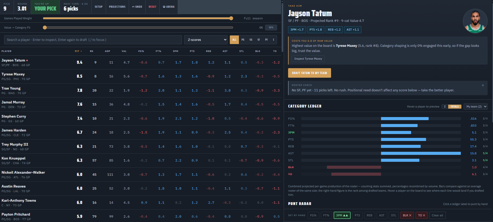

# NineCat

A fantasy basketball draft tool for 9-cat leagues.

I built NineCat to help with the part of drafting that normal rankings don't really account for — how a player fits with the team you've already drafted.

 

It looks at projected value, category fit, ADP, punt strategies, and who's likely to still be available at your next pick.

### What it does

- 9-cat player rankings
- Adjusts recommendations based on your roster
- Tracks category strengths and weaknesses
- Supports punt strategies
- Uses ADP to account for how long you can wait on a player
- Lets you compare projections against last season
- Tracks the full draft board and other teams

### Try it

**[9cat.fyi](https://9cat.fyi)**

### Projections

You can paste in your own projection data from most fantasy basketball sites. NineCat reads the table and builds the board from it.

Last season's stats are included for comparison.

### Note

Projection data belongs to the original publishers and isn't included in the public repo unless it's openly licensed.
